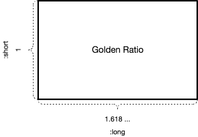

# SpecialRatio

[](https://travis-ci.org/kami30k/special_ratio)
[](http://badge.fury.io/rb/special_ratio)

SpecialRatio is a utility for designer.
Calculate value for designing by using some classic methods.
e.g. Golden Ratio, Silver Ratio.

## Installation

Add this line to your application's Gemfile:

```ruby
gem 'special_ratio'
```

And then execute:

    $ bundle

Or install it yourself as:

    $ gem install special_ratio

## Usage



SpecialRatio has two class - GoldenRatio and SilverRatio.
It expects for receive `:long` or `:short` or `:sum` parameter.

Example of this gem is as follows:

```ruby
golden_ratio = SpecialRatio::GoldenRatio.new(long: 100)

golden_ratio.long  #=> 100
golden_ratio.short #=> 61.80469715698393
golden_ratio.sum   #=> 161.80469715698393

silver_ratio = SpecialRatio::SilverRatio.new(short: 100)

silver_ratio.long  #=> 141.4
silver_ratio.short #=> 100
silver_ratio.sum   #=> 241.39999999999998
```

## Contributing

1. Fork it ( https://github.com/kami30k/special_ratio/fork )
2. Create your feature branch (`git checkout -b my-new-feature`)
3. Commit your changes (`git commit -am 'Add some feature'`)
4. Push to the branch (`git push origin my-new-feature`)
5. Create a new Pull Request
