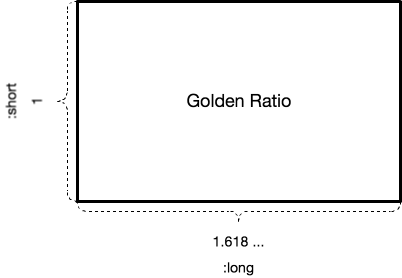

# RatioForDesign

[](https://travis-ci.org/kami30k/ratio_for_design)

RatioForDesign is a utility for designer.
Calculate value for designing by using some classic methods.
e.g. Golden Ratio, Silver Ratio.

## Installation

Add this line to your application's Gemfile:

```ruby
gem 'ratio_for_design'
```

And then execute:

    $ bundle

Or install it yourself as:

    $ gem install ratio_for_design

## Usage

At first, include `RatioForDesign` module.

```ruby
include RatioForDesign
```

Then you can use `golden_ratio()` and `silver_ratio()`.
These take parameters: `:long` or `:short`.

```ruby
p golden_ratio(long: 100)  #=> 61.80469715698393
p golden_ratio(short: 100) #=> 161.8
```

Parameter `:long` and `:short` are as follow.
If you give `:long` parameter, you can get a value of `:short`.



## Contributing

1. Fork it ( https://github.com/kami30k/ratio_for_design/fork )
2. Create your feature branch (`git checkout -b my-new-feature`)
3. Commit your changes (`git commit -am 'Add some feature'`)
4. Push to the branch (`git push origin my-new-feature`)
5. Create a new Pull Request
